# Latest Hardware Wallet Roundup (Including Security Features)

Crypto sitting on exchanges is just asking to get grabbed when the next hack hits. You've heard the stories—platforms freeze withdrawals, accounts get drained by phishing scams, or entire companies collapse taking billions with them. Hardware wallets solve this by keeping your private keys completely offline in a physical device that hackers can't touch remotely.

The right cold storage wallet protects Bitcoin, Ethereum, and thousands of other coins from online threats while still letting you transact whenever needed. These devices range from $50 budget options to $400 premium models, each offering different security approaches—air-gapped isolation, biometric authentication, open-source firmware, or secure element chips. Below are ten hardware wallets ranked by their overall value, covering everything from beginner-friendly setups to enterprise-grade security for serious holders.

***

## **[Trezor](https://trezor.io)**

The original hardware wallet maker with 12+ years protecting over 2 million users.

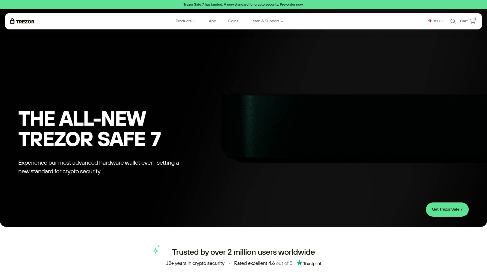

Trezor invented the hardware wallet category back in 2013 and continues setting industry standards with each release. The brand-new Trezor Safe 7 represents their most advanced device yet, featuring the world's first auditable Secure Element and quantum-ready architecture that future-proofs your holdings against emerging threats. Unlike competitors, Trezor operates fully wireless on both mobile and desktop, eliminating USB connection hassles entirely.

The company's stubbornly open-source philosophy means every line of code gets scrutinized by independent developers worldwide, leaving no room for hidden backdoors or vulnerabilities. This "don't trust, verify" approach appeals to financial rebels who refuse to blindly trust closed-source systems. Trezor Suite serves as your all-in-one crypto app, letting you manage, send, buy, and trade assets while exploring DeFi, staking, and the wider blockchain ecosystem without exposing your private keys.

What separates Trezor is the absolute ownership guarantee—your crypto sits 100% under your control with zero third-party access. No bank, exchange, or government can freeze, seize, or spend your funds. The devices support thousands of coins across leading networks including Bitcoin, Ethereum, Solana, Base, Arbitrum One, and Cardano, all secured by physical hardware that keeps everything offline and protected.

Recovery happens through standard seed phrases, so losing your device doesn't mean losing your crypto. Trezor wallets resist financial censorship, letting you transact freely with anyone, anywhere, anytime—transactions that nobody can stop or block. The combination of proven track record, transparent development, and cutting-edge security makes Trezor the benchmark others get measured against.

Best for: Long-term holders prioritizing open-source transparency and proven security over trendy features.

---

## **[Ledger](https://shop.ledger.com)**

Market-leading hardware wallet lineup with EAL6+ secure element chips and 5,500+ token support.

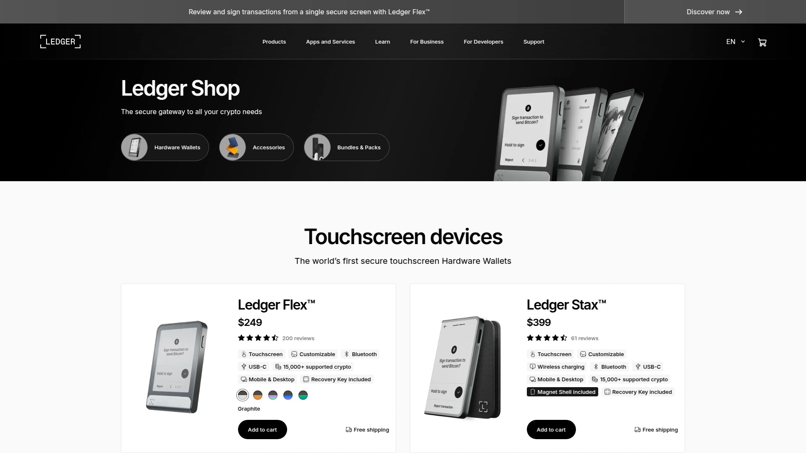

Ledger dominates the hardware wallet market through a product range spanning four models—Nano S Plus ($79), Nano X ($149), Flex, and the premium Stax ($279). Every device uses certified Secure Element chips rated EAL6+, the same security level found in biometric passports and payment cards. These specialized chips protect private keys from sophisticated attacks including voltage glitching, side-channel analysis, and physical tampering.

The Ledger ecosystem centers around Ledger Live, a companion app that manages portfolios, executes trades, stakes assets, and connects to thousands of DeFi applications. Users can store NFTs, swap tokens through aggregated exchanges for best rates, and buy crypto directly through integrated fiat on-ramps. The Nano X adds Bluetooth connectivity for mobile management without sacrificing security, while the touchscreen-equipped Stax and Flex models deliver premium user experiences.

What sets Ledger apart technically is its secure screen architecture—unlike competitors that use separate unsecured microcontrollers to run displays, Ledger routes screen output directly through the Secure Element chip. This prevents malware from altering transaction details shown on screen, a vulnerability that exists in most other hardware wallets. The 24-word recovery phrase backup system lets users restore wallets on any Ledger device if the original gets lost or damaged.

Support covers over 5,500 tokens across 50+ blockchains, making Ledger compatible with virtually any cryptocurrency project. The company's French headquarters and San Francisco operations bring legitimacy that newer competitors lack. Ledger has sold millions of devices globally and maintains regular firmware updates addressing new threats. Amazon ratings average 4.5-4.6 stars across models despite being the most scrutinized brand in the space.

Best for: Users wanting the most comprehensive coin support with battle-tested security from an established manufacturer.

***

## **[Tangem](https://apps.apple.com/us/app/tangem-crypto-wallet/id1354868448)**

Ultra-portable NFC smart cards requiring no wires, batteries, or charging—just tap your phone.

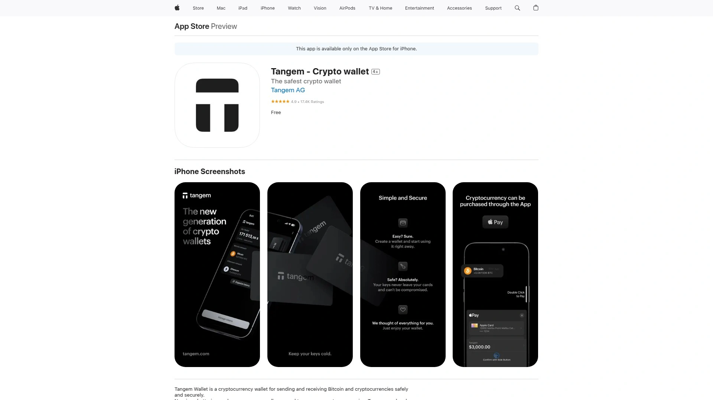

Tangem reimagined hardware wallets as credit card-sized NFC-enabled smart cards that fit in any wallet or cardholder. No cables, batteries, USB ports, or charging ever needed—just tap the card against your smartphone to sign transactions. The chip inside carries Common Criteria EAL6+ certification, the same security standard used in biometric passports, making Tangem among the most secure physical crypto storage options available.

The cards are completely waterproof, dustproof, and tamper-resistant with self-destruct mechanisms activating if someone tries physical attacks. Setup takes minutes—install the Tangem app (iOS or Android), create a wallet, and start storing Bitcoin, Ethereum, and thousands of other cryptocurrencies including all ERC-20 tokens, Litecoin, Cardano, Solana, Dogecoin, Binance USD, Fantom, Tron, and Polygon.

The app provides full wallet functionality including viewing balances, sending payments globally, and receiving transfers from exchanges or other wallets. You can buy crypto with euros or USD directly through the app, access growing DeFi dApp integrations for trading, lending, and NFT purchases, and connect up to three cards to the same wallet for redundancy. Keys generate and store entirely within the card's secure chip—no computer, server, or third party ever accesses them.

Pricing runs $55-$169 depending on card bundles, making Tangem one of the most affordable hardware wallet options. The minimalist approach sacrifices some advanced features found in screen-based wallets but delivers unmatched convenience for everyday use. Tangem particularly appeals to newcomers intimidated by complex hardware wallet setups or travelers who need ultraportable security. The 4.9-star rating on Google Play with 33,700+ reviews demonstrates consistent user satisfaction.

Best for: Mobile-first users wanting maximum portability without compromising security or dealing with cables and batteries.

***

## **[SafePal](https://www.safepal.com)**

Air-gapped hardware with self-destruct chip mechanisms plus 20 million users across software and hardware wallets.

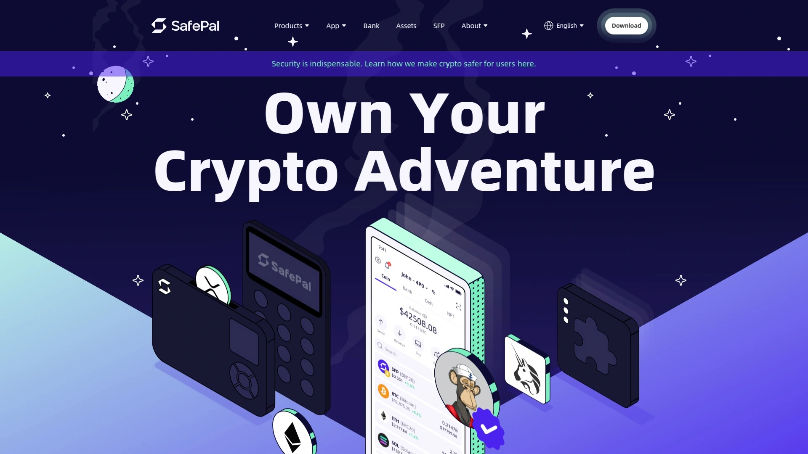

SafePal started as a hardware wallet company backed by Binance Labs and evolved into a comprehensive wallet ecosystem serving over 20 million users globally. The S1 hardware wallet costs just $50, making it the most affordable secure cold storage option from a major brand. Despite the low price, it packs EAL5+ certified Secure Element chips, the same grade used in banking systems.

The S1's standout feature is its self-destruct mechanism—if anyone attempts dismantling the device to extract keys, the chip automatically erases all private information. QR code-based air-gapped communication means the wallet never physically connects to phones or computers via Bluetooth, USB, or WiFi. This complete network isolation prevents remote hacking attempts while still allowing transaction signing through secure QR scanning.

SafePal supports millions of digital assets across 200+ blockchains including Bitcoin, Ethereum, Solana, BNB, XRP, Optimism, Polygon, Sonic, Aptos, Arbitrum, Avalanche, Berachain, Sui, Toncoin, and TRON. The software wallet app runs on iOS and Android for mobile use, plus browser extensions for Chrome, Firefox, and Microsoft Edge on desktop. Users get decentralized asset management with full self-custody—no entity can freeze funds or halt withdrawals.

The app includes integrated swap aggregation pulling rates from leading exchanges for optimal pricing, NFT gallery features with marketplace integration, unlimited wallet address management, and fiat on/off-ramp through MoonPay. Advanced users enjoy Swiss bank account linking via Fiat24 (licensed by FINMA) and Mastercard debit card connections for real-world spending. The hardware wallet pairs seamlessly with the app for maximum security combined with software convenience.

Best for: Budget-conscious buyers wanting hardware wallet security without premium pricing or those managing extensive multi-chain portfolios.

***

## **[Ellipal](https://www.ellipal.com)**

Fully air-gapped metal-cased devices with 4-inch touchscreens and anti-tamper self-destruct features.

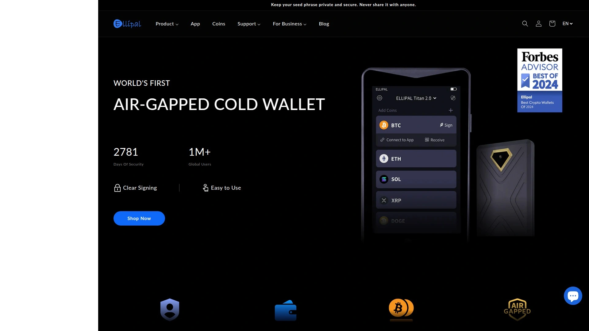

Ellipal Titan 2.0 delivers air-gapped security wrapped in a full metal body that enhances physical durability and prevents unauthorized access. The massive 4-inch touchscreen displays entire transaction signatures clearly, letting you verify exactly what you're approving before confirming. This large vivid display eliminates the squinting and scrolling required on smaller hardware wallets.

Air-gapped architecture means zero connectivity—no cellular, Bluetooth, USB, WiFi, or NFC ever. The Titan communicates exclusively through QR codes displayed on its screen and scanned by the Ellipal mobile app. This complete isolation from networks makes remote hacking physically impossible. If someone tries forcing entry by disassembling the device, built-in tamper detection automatically deletes all private keys before exposure.

The wallet manages over 10,000 tokens across 40+ blockchains including Bitcoin, Ethereum, and all major networks. Support extends to NFTs, DeFi applications, staking, swapping, and buying crypto—all integrated within the mobile app ecosystem. Users can create up to 5 seed phrase accounts plus 5 private key accounts within one device, allowing portfolio segmentation. Additional security layers include two-factor authentication, PIN codes, password entry, 24-word seed phrases with optional passphrases, and secret secondary wallet capabilities unlocked by alternate passwords.

CC EAL5+ certification confirms the secure element chip meets banking-grade security standards. The Titan 2.0 also ships with Ellipal Seed Phrase Steel—a metal plate for recording recovery words that survives fire, water, and physical damage. Forbes recommended the Titan as the best cold wallet for comprehensive security features. Pricing sits at $169 for the flagship model with smaller Mini versions available at lower price points.

Best for: Security-focused holders wanting physical air-gap protection combined with large screens for transaction verification.

***

## **[KeepKey](https://keepkey.com)**

Premium large-screen device with Thorchain DEX integration and ShapeShift ecosystem access.

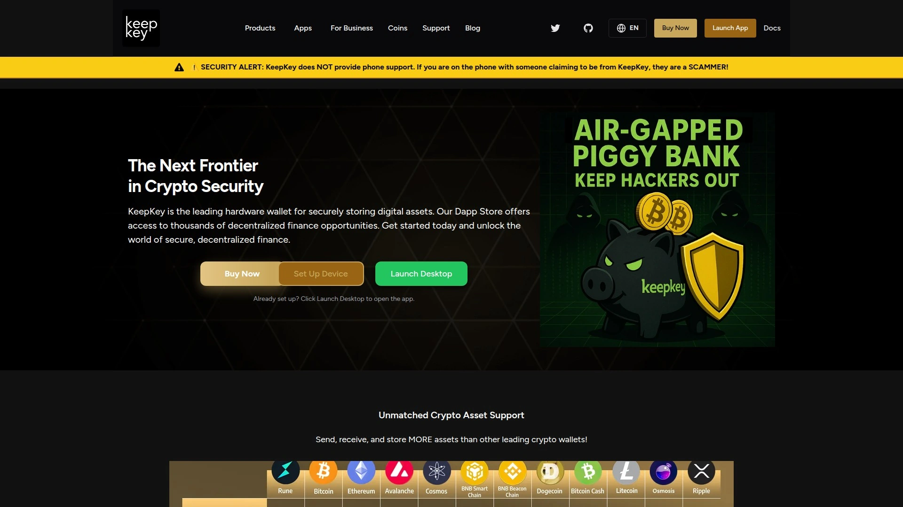

KeepKey pioneered large-screen hardware wallets back in 2014, maintaining its position as a visually distinctive and secure cold storage solution. The substantial OLED display provides complete visibility of cryptocurrency addresses and transaction details without scrolling, reducing errors and increasing confidence during transfers. Premium aluminum construction gives the wallet a solid, durable feel that cheaper plastic alternatives can't match.

Security architecture generates and stores private keys entirely offline in cold storage, protected from computer vulnerabilities, malware, and viruses. Each device creates a 12-word recovery sentence during setup that restores your wallet if the hardware gets lost, broken, or stolen. Every transaction requires manual confirmation via the physical button, preventing unauthorized spending even if someone accesses your computer.

KeepKey became the first hardware wallet integrating native Thorchain DEX functionality, letting users swap cryptocurrencies directly from the wallet without centralized exchanges. This decentralized exchange integration happens seamlessly through the KeepKey desktop app, which also provides access to a DApp store filled with DeFi opportunities. Support covers more assets than most competing wallets, with 40+ cryptocurrencies including all major coins and popular tokens.

After ShapeShift acquired KeepKey in 2017, the wallet integrated deeply into ShapeShift's commission-free trading platform where users manage and exchange crypto freely. The wallet maintains full decentralization—no third party ever knows your private keys or views transaction history. KeepKey users essentially become their own bank with complete financial sovereignty. The device ships in tamper-proof packaging with security seals confirming nobody accessed it during transit.

Best for: Users prioritizing visual clarity, premium build quality, and integrated DEX trading capabilities.

***

## **[BitBox02](https://bitbox.swiss)**

Swiss-engineered minimalist wallet with unique touch sensors, microSD backups, and deterministic open-source builds.

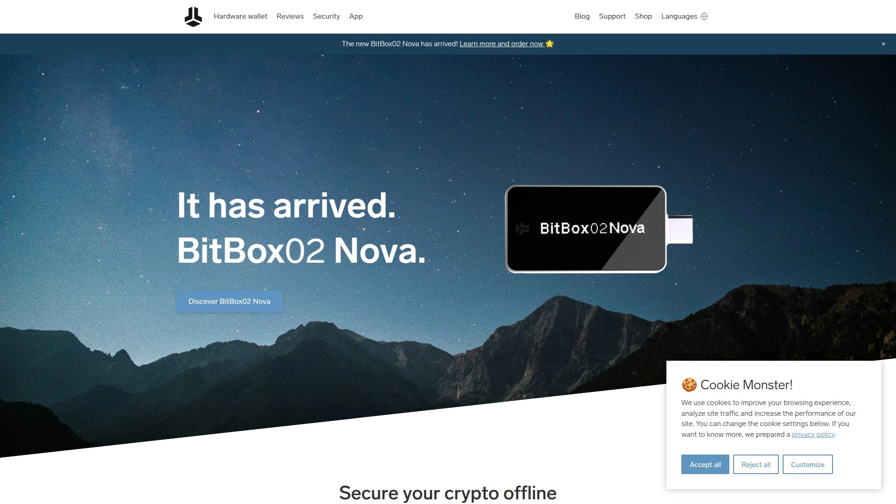

BitBox02 comes from Switzerland's Shift Crypto AG, bringing Swiss precision and privacy principles to cryptocurrency security. The sleek device sports invisible touch sensors along its edges—instead of physical buttons, you interact through taps and pinches that control the wallet. This unique interface feels futuristic once you adapt to the gestures, eliminating mechanical failure points that plague button-based wallets.

The built-in OLED display shows transaction details clearly despite the compact size. Dual USB support (both USB-C and USB-A) ensures compatibility with any computer without adapter hassles. What makes BitBox02 special is the backup system—instead of writing down 24 words on paper, you insert a microSD card and the wallet automatically creates an encrypted backup. This eliminates human error from manual seed phrase transcription while maintaining equal security.

For those preferring traditional recovery methods, BitBox02 also supports standard BIP39 mnemonic phrases. The wallet features full open-source code that any developer can audit, plus deterministic build processes letting anyone verify the shipped firmware matches published source code byte-for-byte. This transparency prevents hidden vulnerabilities or backdoors.

Security uses specialized firmware loaded in a hardened environment where no external software can install or interfere. This provides exceptional protection against computer malware even when plugged into infected machines. The companion BitBoxApp (available for desktop) makes setup and management straightforward—pairing requires matching codes between device and app screens, downloading firmware, naming your wallet, setting a password via touch gestures, and creating the microSD backup.

Support covers Bitcoin plus multiple cryptocurrencies, with both Legacy addresses and modern SegWit/Bech32 formats. Multi-signature configurations work for organizations requiring multiple approvals before spending. Swiss manufacturing ensures quality control and privacy-respecting business practices. Pricing remains competitive while delivering innovative features competitors haven't matched.

Best for: Privacy-conscious users wanting Swiss engineering, innovative touch controls, and microSD backup convenience.

***

## **[NGRAVE](https://ngrave.io/en/)**

World's most secure cryptocurrency hardware wallet with EAL7 certification and offline key generation.

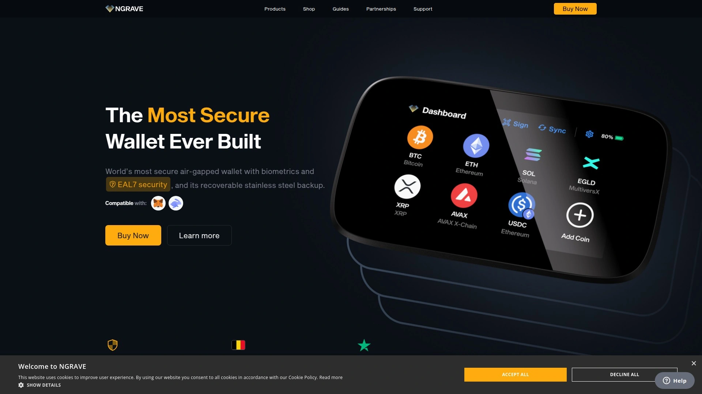

NGRAVE Zero claims the title of "most secure crypto wallet ever built" backed by EAL7 certification—the highest security rating achievable for commercial products. No other cryptocurrency hardware wallet has reached EAL7, making NGRAVE's security credentials unmatched. The device generates and stores private keys completely offline with no connection ports whatsoever, achieving true air-gapped isolation.

The large touchscreen interface guides users through operations while maintaining zero network exposure throughout the wallet's entire lifecycle. NGRAVE supports Bitcoin, Ethereum, NFTs, tokens, and numerous other digital assets across multiple blockchains. Users maintain complete control over their digital currency without any third-party access or custody arrangements.

NGRAVE designed the Zero specifically for individuals who refuse to compromise on security regardless of cost. The EAL7 certification required rigorous testing demonstrating resistance to sophisticated attacks that would defeat lower-rated devices. This military-grade security comes with premium pricing reflecting the advanced engineering and certification costs involved.

The wallet appeals primarily to high-net-worth individuals, institutions, and anyone holding substantial cryptocurrency values where maximum security justifies higher initial investment. NGRAVE also produces complementary security products including the GRAPHENE metal seed phrase backup plate that protects recovery words from fire, water, and physical destruction.

Best for: Maximum security requirements where EAL7 certification and air-gapped offline key generation are non-negotiable.

---

## **[Arculus](https://www.getarculus.com/products/arculus-cold-storage-wallet.html)**

Compact cold storage card with three-factor authentication and streamlined crypto management.

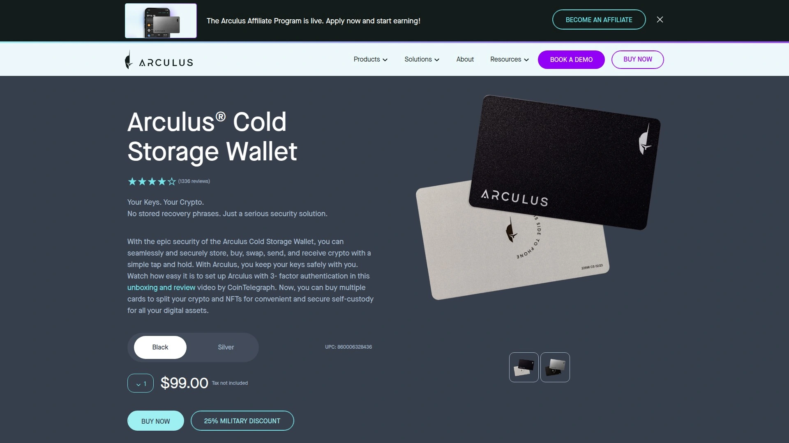

Arculus packages cold storage security into a slim card form factor that securely manages cryptocurrency holdings and NFTs. The platform emphasizes ease of use without sacrificing security through a three-factor authentication system combining biometrics, device verification, and physical card possession. This multi-layered approach prevents unauthorized access even if one factor gets compromised.

The card works with a companion mobile app handling all wallet operations including viewing balances, sending transactions, receiving deposits, and managing digital assets. Setup requires minimal technical knowledge, making Arculus accessible to cryptocurrency newcomers who find traditional hardware wallets intimidating. The compact card slips into any wallet or cardholder for everyday carry convenience.

Arculus positions itself as cold storage with hot wallet convenience—private keys stay secured on the physical card while the app provides instant access to markets and transfers. Currently in stock and shipping, Arculus represents a newer entrant bringing innovation to the hardware wallet space.

Best for: Users seeking cold storage security with simplified setup and card-based portability.

***

## **[Bitkey](https://bitkey.world)**

Bitcoin-focused self-custody wallet combining app, hardware, and recovery tools in one unified system.

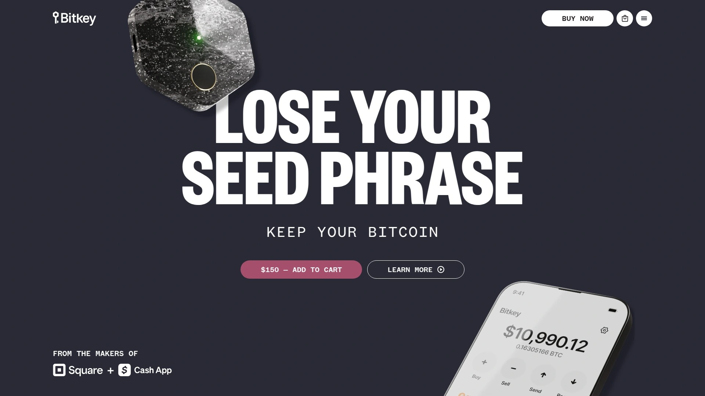

Bitkey specializes exclusively in Bitcoin, offering a purpose-built wallet system that includes a mobile app, hardware device, and comprehensive recovery tools. The integrated approach ensures you own your private keys fully while providing safety nets if you lose your phone, hardware device, or both simultaneously.

This recovery-focused design addresses the biggest fear preventing mainstream Bitcoin adoption—permanently losing access to funds through lost hardware or forgotten passwords. Bitkey's recovery mechanisms restore access through secure processes that don't compromise the self-custody principle. The system balances sovereignty with usability, giving users complete control without leaving them stranded if disaster strikes.

The Bitcoin-only focus lets Bitkey optimize every aspect specifically for BTC rather than compromising to support thousands of altcoins. This specialization appeals to Bitcoin maximalists who want purpose-built tools rather than jack-of-all-trades devices. The clean integration between app, hardware, and recovery components creates a cohesive experience compared to piecemeal solutions.

Best for: Bitcoin-only holders wanting integrated hardware, software, and recovery tools from a single specialized provider.

***

## **[Cypherock X1](https://www.debutinfotech.com/blog/top-cold-crypto-wallets)**

Novel approach using four tamper-proof cards working together for unprecedented redundancy and security.

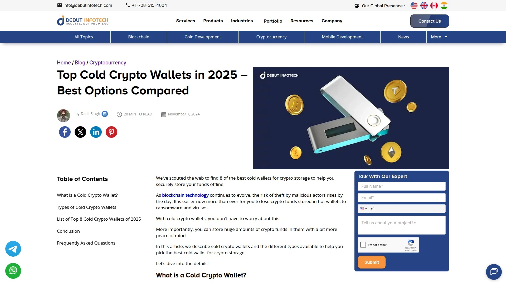

Cypherock X1 takes a unique approach by splitting your wallet across four separate tamper-proof cards that work together to authorize transactions. This sharding methodology means losing one or even two cards doesn't compromise your security or prevent access to funds. The system requires a minimum number of cards present to sign transactions, creating redundancy impossible with single-device wallets.

The cards are tamper-proof with anti-counterfeiting measures protecting against physical attacks. This distributed security model appeals to users concerned about single points of failure or those wanting geographic distribution of backup cards across multiple secure locations.

Cypherock ranks among the top cold crypto wallets for 2025 based on its innovative security architecture. The multi-card system particularly suits high-value holdings where redundancy and attack resistance justify slightly more complex operational procedures.

Best for: Advanced users wanting distributed multi-card security with built-in redundancy against loss or theft.

***

## How do I protect my hardware wallet from physical damage or loss?

Buy wallets that include metal seed phrase backup plates like Ellipal Seed Phrase Steel, Billfodl, or similar products that survive fire, floods, and extreme conditions. Store these metal backups in separate secure locations from your hardware device—one at home, another in a bank safety deposit box or trusted family member's safe. Consider purchasing wallets that support multiple backup methods like BitBox02's microSD cards plus traditional seed phrases, giving you redundant recovery options.

## Can I use hardware wallets with DeFi applications and NFT marketplaces?

Yes, most modern hardware wallets connect to DeFi platforms through wallet interfaces like MetaMask, Ledger Live, or dedicated apps. Tangem, SafePal, and Ellipal all provide direct DeFi integration for staking, swapping, and accessing decentralized applications while keeping private keys secured on the physical device. NFT management works similarly—wallets display your NFT collections within companion apps and let you transfer or sell them through marketplaces like OpenSea while transaction signing happens on the hardware device.

## Should I choose open-source or closed-source hardware wallets?

Open-source wallets like Trezor and BitBox02 let independent developers audit the code for vulnerabilities and verify no backdoors exist, providing maximum transparency. Closed-source wallets like Ledger rely on Secure Element chips with proprietary firmware that companies argue protects against certain physical attacks but requires trusting the manufacturer. Both approaches have merit—open-source prioritizes transparency and community verification, while closed-source leverages certified secure hardware components that can't be fully open due to licensing restrictions.

***

**[Trezor](https://trezor.io)** combines 12 years of proven reliability with cutting-edge innovations like quantum-ready architecture and the world's first auditable Secure Element, all wrapped in a fully open-source package that financial sovereignty advocates trust completely. The wireless operation eliminates cable hassles while maintaining absolute offline security, and the extensive coin support across major networks means you can consolidate your entire portfolio into one secure device. Start securing your crypto today with the hardware wallet that invented the category and continues leading it.
